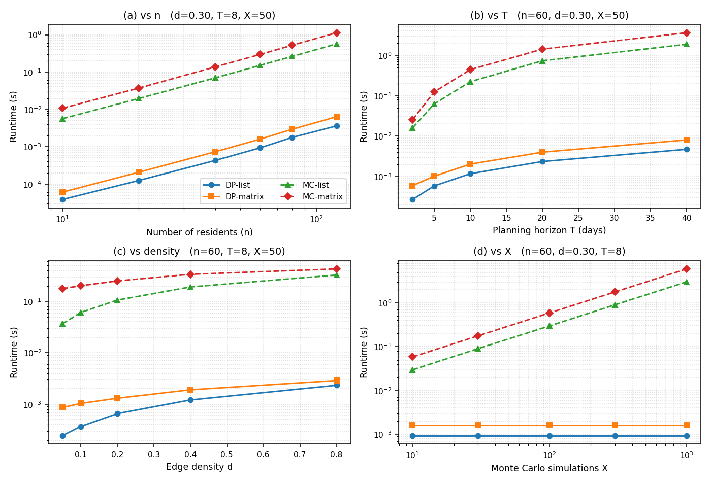

\thispagestyle{empty}

\vspace*{4cm}

\begin{center}
{\Huge\bfseries Graph Algorithms in Action}\\[0.4cm]
{\LARGE Modelling a Disease Outbreak}\\[1.5cm]
{\Large Take-Home Assignment Report}\\[0.6cm]
{\large COSC2123/3119 --- Algorithms and Analysis}\\[0.3cm]
{\large RMIT University --- Semester 1, 2026}\\[2cm]
{\Large\bfseries Danial Awais Ansari}\\[0.3cm]
{\large Student ID: 4119075}
\end{center}

\vfill

\newpage

# Task B: Estimating Infection Risk Over Time (4 marks, 1 page)

## Pseudo-code (1 mark)

```
Algorithm  TaskB(G, s, T)
Require:   Graph G = (V, E); source s; horizon T
Ensure:    Risk table where table[t][i] = r_{t,i}

 1: table ← (T + 1) × |V| array initialised to 0.0
 2: table[0][s.index] ← 1.0                      // base case: only s is infected
 3: for each day t = 1 to T do
 4:     prev ← table[t − 1];  curr ← table[t]
 5:     for each vertex V_i ∈ V do
 6:         escape ← 1 − prev[i]
 7:         for each neighbour V_j of V_i do
 8:             escape ← escape · (1 − prev[j] · w_{ij})
 9:         curr[i] ← 1 − escape
10:     curr[s.index] ← 1.0    // pin patient zero (recurrence already preserves this)
11: return table
```

## Limitations of the recurrence (3 marks)

**(a) Structural property.** The recurrence treats the events "neighbour V_j is infected by day t − 1" as independent across all neighbours of V_i, then combines their escape probabilities into a single product. On any non-trivial graph this independence assumption breaks for two reasons. First, when two neighbours of V_i share a path back to the source, their infection events draw on overlapping probability and the product silently double-counts that shared mass. Second, in an undirected graph a neighbour V_j may itself have been infected only through V_i, yet the product still credits V_j with an independent opportunity to infect V_i in the next step. In both cases the recurrence treats correlated infection events as if they were independent, which is why the value it produces is an approximation of the true infection probability rather than the exact value.

**(b) Numerical example.** Consider the three-vertex chain V_0, V_1, V_2 with transmission weights w_{01} = 0.8 and w_{12} = 0.6. Iterating the recurrence to day 2 gives V_1 a risk of 0.96 and V_2 a risk of 0.48. Applying the day-3 update to V_1 then produces a risk of 0.9943, because the escape factor unfolds as (1 − 0.96)(1 − 1.0 × 0.8)(1 − 0.48 × 0.6) = 0.04 × 0.2 × 0.712. The true probability that V_1 is infected by day 3 is 0.992, which can be obtained in closed form as 1 − (1 − 0.8)^3, since V_0 is V_1's only source of infection and each day represents an independent transmission attempt. The gap of 0.0023 is small, but it exposes the over-estimate clearly: the factor 0.712 inside the product behaves as though V_2 were an independent infector of V_1, when in fact V_2's 0.48 probability mass was generated by V_1 in the first place and cannot reflect a separate pathway.

**(c) Exact class.** The recurrence is exact on graphs that form a star centred at the source, that is, graphs in which every non-source vertex has V_0 as its only neighbour (isolated vertices, which never become infected, may also be present). On such a graph the neighbour product for each leaf collapses to a single factor (1 − w_{0i}), and the recurrence unrolls to a closed-form expression:

$$r_{t,i} = 1 - (1 - w_{0i})^t.$$

This is exactly the probability of failing t independent daily transmission attempts. Both failure modes identified in part (a) are absent: there are no cycles through which upstream paths could overlap, and the only neighbour each leaf sees is the source itself, whose own risk is pinned at 1 throughout. The exact class is therefore strictly narrower than the class of trees, because part (b) showed the recurrence is already approximate on a three-vertex path, which is itself a tree. As soon as any non-source vertex acquires a second neighbour, the back-flow problem emerges and the assumption fails.

\newpage

# Task C: Analysis of Infection Risk Algorithms (8 marks, 2 pages)

Let n be the number of residents, m the number of edges, T the planning horizon, and X the number of Monte Carlo simulations.

## Algorithm Complexity Analysis (2 marks)

| Algorithm × Representation | Worst-case time | Dominant operation |
|---|---|---|
| (a) Monte Carlo × Matrix | O(X · T² · n²) | row scan over all n cells in `get_neighbours()` (line 6, Algorithm 1) |
| (b) Monte Carlo × List   | O(X · T² · (n + m)) | linked-list traversal, 2m work per inner day |
| (c) Task B DP × Matrix   | O(T · n²)           | row scan in the neighbour-product loop (line 8, Algorithm 2) |
| (d) Task B DP × List     | O(T · (n + m))      | linked-list traversal in the same loop |

The extra factor of XT in the Monte Carlo rows arises because the baseline launches X fresh simulations at each of the T outer days, and every simulation replays the outbreak from day 1 up to the current day, contributing roughly T²/2 inner-day passes per simulation. The DP avoids this entirely, since each column depends only on the previous one and every edge is visited exactly once per day. The representation only affects the neighbour-enumeration cost: the matrix scans n cells per vertex regardless of edge count, while the list traverses only the true neighbours, with total work proportional to the sum of degrees. Lists therefore dominate on sparse graphs, and the two converge as density approaches 1.

## Empirical Design (2 marks)

Four parameters drive the runtime: the population size n, the edge density d = m / C(n, 2), the planning horizon T, and the number of Monte Carlo simulations X. To isolate the contribution of each, I vary one parameter at a time and hold the others fixed. Parameters that do not appear in any of the complexity expressions (the maximum transmission probability, the vulnerability and dosage ranges) are kept at their default values.

| Experiment | Vary | Hold fixed | What it isolates |
|---|---|---|---|
| (a) | n ∈ {10, 20, 40, 60, 80, 120}   | d = 0.30, T = 8, X = 50 | Scaling with population size |
| (b) | T ∈ {2, 5, 10, 20, 40}          | n = 60, d = 0.30, X = 50 | DP linear in T versus MC quadratic in T |
| (c) | d ∈ {0.05, 0.1, 0.2, 0.4, 0.8}  | n = 60, T = 8, X = 50   | Matrix density-independence versus list density-sensitivity |
| (d) | X ∈ {10, 30, 100, 300, 1000}    | n = 60, d = 0.30, T = 8 | MC linear in X; DP independent of X |

Each data point reports the mean of three trials on independent random graphs. Only the algorithm call itself is timed, with graph construction excluded per the assignment specification. Log axes are used whenever the swept parameter spans more than one decade.

## Empirical Analysis (2.5 marks)

{width=78%}

**(a) Varying n.** All four series produce straight log-log lines of slope roughly 2. At d = 0.30 the edge count grows as m ≈ 0.15 n², so even the list-based DP is effectively n²-bounded. The DP and MC clusters are separated by a factor of about 150, within an order of magnitude of the predicted XT = 400 ratio, and inside each cluster the matrix is around 1.7 times slower than the list.

**(b) Varying T.** The DP grows linearly in T: a fourfold increase in horizon produces a fourfold increase in runtime. Monte Carlo bends upward and grows much faster, with the list variant rising from 222 ms at T = 10 to 1878 ms at T = 40, a factor of 8.4 that is close to the predicted T² ratio of 16.

**(c) Varying density.** The matrix curves are nearly flat as density rises, since the row scan visits n cells whether or not they hold edges. The list curves rise approximately linearly with m, and the gap between the two shrinks from roughly fivefold at d = 0.05 to about 1.3 at d = 0.80, which is the textbook crossover point where the sum of degrees approaches n².

**(d) Varying X.** Both Monte Carlo variants produce slope-1 log-log lines, while the DP runtimes remain flat at about 0.9 ms (list) and 1.7 ms (matrix), independent of X. Even at X = 1000 the Monte Carlo error on cyclic networks is still 1 to 2 per cent per cell relative to the exact DP, which locks in at least a 100-fold slowdown at any useful accuracy.

## Reflection (1.5 marks)

The empirical results align with the complexity analysis in every panel. Each observed slope agrees with its predicted dominant term to within constant factors, and the qualitative features expected from the analysis (matrix density-independence, MC quadratic growth in T, DP independence from X) are visible at a glance.

**Recommendation for Metropolis.** The city is large, sparsely connected, and uses a modest planning horizon. Of the four options analysed, the DP on a list representation is the right choice, because it is exact, independent of X, linear in T, and scales with the number of edges rather than the square of the population. In the sweep at n = 60 and d = 0.05 it ran 145 times faster than the list-based Monte Carlo and 3.5 times faster than the matrix-based DP, which at city scale means sub-second daily updates rather than minutes for Monte Carlo at comparable accuracy. Daily changes to transmission weights or contact connections do not alter this picture, because the DP recurrence is structural and generalises directly to time-varying weights at the same cost.

\newpage

# Task D: Antiviral Allocation (6 marks, 2 pages)

Let n be the number of eligible residents, C the total dose budget, c_i the dose requirement of resident i, and b_i the infection-risk benefit r_{i,T} computed by Task B.

## Algorithm Design (1 mark)

The allocation problem is a 0/1 knapsack with real-valued benefits and a secondary objective of using the fewest doses to achieve the maximum benefit. I solve it with top-down memoisation. The memo is a two-dimensional table of size (n + 1) × (C + 1), and each cell memo[i][c] stores a pair: the best benefit achievable when considering only the first i residents under a capacity of c, together with the smallest number of doses that achieves that benefit. Storing the secondary objective directly inside each cell folds the tiebreak into the recurrence and removes any need for a second pass over the table.

The base case applies when there are no residents to consider (i = 0) or no remaining capacity (c = 0), in which case the best achievable result is the empty pair (0.0, 0). For i ≥ 1 and c ≥ 1 the algorithm compares two options:

```
skip = solve(i − 1, c)                          # do not vaccinate person i
take = solve(i − 1, c − c_i) + (b_i, c_i)       # vaccinate person i, if c_i ≤ c
memo[i][c] = take  if take.benefit > skip.benefit (strictly better)
                   OR (equal benefit AND take.doses < skip.doses)
             else skip
```

The result is a lexicographic maximum over the pair (benefit, fewest doses): the larger benefit always wins, and equal benefits are broken in favour of the option that uses fewer doses. To recover which residents were chosen, a backtracking pass walks i from n down to 1, replaying the same skip-versus-take comparison and deducting c_i from a running capacity counter whenever the take option won.

## Complexity Analysis (1 mark)

The forward pass touches at most nC unique (i, c) cells, each requiring constant work plus two memoised recursive calls. The backtracking pass adds O(n), and the recursion stack uses O(n) auxiliary memory, so the total time and space are both O(nC). The algorithm is pseudo-polynomial in the sense that it is linear in the dose budget C but independent of how large any individual dose requirement c_i may be. By comparison, a brute-force enumeration of subsets is O(2^n), so the DP is exponentially faster whenever C is smaller than 2^n / n, which holds comfortably for any realistic intervention budget.

## Extension 1: Triage by K vulnerability tiers (2 marks)

If residents are sorted into K vulnerability tiers, with T_1 the most vulnerable and T_K the least, the policy requires that the doses available to tier T_{k+1} are only those that tier T_k did not consume. The same DP solves this problem in cascade: run the existing task_d algorithm K times, threading the remaining capacity through each call.

```
remaining = C;  selected = []
for k = 1 to K do
    subset_k, _, used_k, _ = task_d(T_k, remaining)
    selected += subset_k
    remaining -= used_k
return selected
```

Each tier's call costs O(|T_k| · C) in the worst case, and summing across all tiers gives O((|T_1| + … + |T_K|) · C) = O(nC), the same complexity class as the un-triaged DP. The extra factor of K is absorbed into the constants because the per-tier capacity strictly decreases from one call to the next.

**A small counterexample showing why ignoring vulnerability hurts.** Suppose the dose budget is C = 4 and there are three residents:

| Resident | Tier | Benefit | Dose cost |
|---|---|---|---|
| V_A | 1 (highly vulnerable; would die if infected) | 0.50 | 4 |
| V_B | 2 (low vulnerability)                        | 0.60 | 2 |
| V_C | 2 (low vulnerability)                        | 0.55 | 2 |

The plain knapsack maximises aggregate benefit and picks {V_B, V_C}, returning a total benefit of 1.15 and using all 4 doses, with V_A left unprotected. The triaged DP picks V_A first, because V_A is the only feasible tier-1 choice within the budget; it returns a total benefit of 0.50 and tier 2 receives nothing. The plain knapsack achieves the higher aggregate benefit, but does so by leaving the only resident who would die if infected exposed. Triage trades some aggregate risk reduction for the assurance that clinical priority is respected, which is exactly the trade-off the model is meant to make explicit.

## Extension 2: Interdependent vaccinations (2 marks)

**Why independence is required for the DP.** The DP's optimal substructure depends on each resident i contributing a fixed marginal benefit b_i, regardless of who else is vaccinated. This is what allows memo[i][c] to depend only on i and c. If the benefit of vaccinating i depended on who else had already been vaccinated, two different partial solutions reaching the same (i, c) state would credit person i with different benefits later in the computation, and the best value of the cell would depend on the history of the path that reached it rather than on the state alone.

**A small counterexample.** Consider the chain V_0, V_1, V_2 with high transmission weights and end-of-horizon infection risks r_{1,T} = r_{2,T} = 0.95. Assume that vaccinating a resident effectively drops each of their neighbours' residual risk to zero, since the only exposure pathway is blocked. The dose costs are c_{V1} = c_{V2} = 1 and the budget is C = 1. The independent-benefit DP sees benefits (0.95, 0.95) and costs (1, 1), treats the two options as tied, and reports a benefit of 0.95. The true situation is asymmetric: vaccinating V_1 protects V_1 (saving 0.95) and also drives V_2's residual risk to roughly zero (saving another 0.95), for a true total close to 1.90; vaccinating V_2, by contrast, protects only V_2 and leaves V_1 at 0.95, giving a true total of about 0.95. Vaccinating V_1 is twice as valuable, but the independent-benefit DP cannot distinguish the two options because it has no view of the herd-effect interaction.

**Why the true problem is significantly harder.** Once benefits are interdependent, the contribution of vaccinating any resident depends on who else has been vaccinated, so the state (i, c) is no longer sufficient. An optimal substructure would need to encode the entire vaccinated subset so far, of which there are 2^n possibilities. In addition, evaluating the benefit of any candidate subset requires re-running the Task B risk computation on the graph induced by that subset, because the herd effect changes the residual risks of everyone else in the network. A brute-force enumeration over subsets therefore performs one Task B re-run per subset, giving a worst-case cost of O(2^n · Tm), which is exponentially worse than the O(nC) of the independent-benefit DP. The independent-benefit version solved here is therefore best understood as a simplification of the true problem: cheaper and exact within its abstraction, but blind to the herd-effect amplification that the counterexample above demonstrates.
